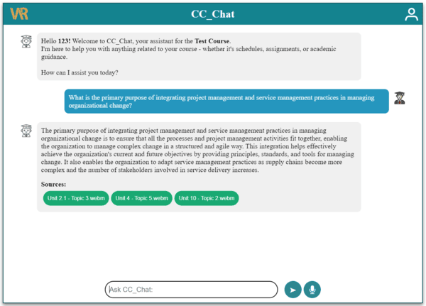

# ccchat-frontend

## Description
This project is designed to handle frontend functionalities for a chatbot enabling students to ask course-related questions. The chatbot will access the course content, course outline, and instructional plan relevant to their program.

## Feature
Student Login: Students must enter their ID. The chatbot will only respond to questions related to their specific program.
Test Login ID: 123

## Installation
1. Clone the repository
```
git clone https://github.com/CVRIAI/ccchat-frontend.git
```
2. Move to the homeworkTracker directory
```
cd ccchat-frontend
```
3. Install all of the packages 
```
npm install
```
4. Launch the application

    - Ensure that the IP addresses in the ccchat-frontend .env file and the ccchat-backend app_noHist.py file are the same.
    4. Launch the application

    - Update all IP addresses in the Chatbot_react .env file to match your ccchat-backend IP

    **Frontend**: 
    
    - Switch directory
        ```
        cd ccchat-frontend
        ```
        
    - Run the code
        ```
        npm run start
        ```
## Demo
- Ask course content realted question

    
